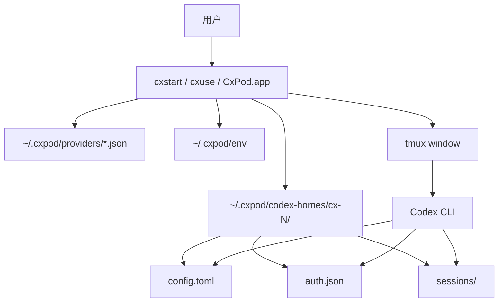

# cxpod

> Codex 多线路工作台：不用反复改配置，就能在 OpenAI 官方线路、公司 relay、第三方 provider 之间切换，并让多个 Codex 会话互不影响。

[](LICENSE)
[](https://github.com/DoubaoYIN/cxpod/releases)

cxpod 是 [ccpod](https://github.com/DoubaoYIN/ccpod) 的姊妹项目。ccpod 针对 Claude Code，cxpod 针对 **Codex CLI / Codex.app**。

## 30 秒读懂

如果你只用一个官方 Codex 账号，其实可以先不装 cxpod。

如果你有下面任意一种情况，cxpod 就有用：

- 你有多个 Codex API 来源，例如 OpenAI 官方、公司内部 relay、第三方中转站。
- 你经常要在不同模型或不同 provider 之间切换。
- 你不想每次手动改 `~/.codex/config.toml` 和 `auth.json`。
- 你想同时开多个 Codex 会话，并且每个会话使用不同线路。
- 你想用一个 macOS 菜单栏 app 启动、附加、切换、关闭这些会话。

cxpod 做的事情很简单：

1. 帮你保存多条 Codex 线路配置。
2. 启动 Codex 时，为每个窗口准备独立配置目录。
3. 切换线路时，自动改配置、换鉴权、重启当前 Codex 会话。
4. 尽量不把真实 key 写进仓库或项目目录。

## 先解释几个词

| 词 | 白话解释 |
|----|----------|
| Codex | 你实际使用的 OpenAI Codex CLI / Codex.app。cxpod 不是 Codex 本体，只是管理 Codex 配置和会话。 |
| Provider / 线路 | Codex 请求发往哪里，比如 OpenAI 官方、公司 relay、第三方中转站。 |
| Relay / 中转站 | 一个兼容 OpenAI API 的服务地址，通常需要自己的 API key。 |
| `CODEX_HOME` | Codex 读取配置、鉴权和会话历史的目录。cxpod 给每个窗口准备独立的 `CODEX_HOME`。 |
| tmux window | 终端里的一个独立会话窗口。cxpod 用它来稳定运行和重启 Codex。 |

## 你会得到什么

- `cxstart`：启动一个 cxpod 管理的 Codex 会话。
- `cxuse`：在当前会话里切换 provider。
- `cxnow`：查看当前和正在运行的会话。
- `cx-status`：底部状态栏，显示 provider、model、上下文使用率。
- `cx-app-switch`：切换 Codex.app GUI 使用的 provider。
- `CxPod.app`：macOS 菜单栏 app，用图形界面管理会话。

## 安装前准备

你需要：

- 一台 Mac。
- 已安装并登录 Codex.app / Codex CLI。
- 可以打开 Terminal 终端。
- 网络能访问 GitHub。

安装脚本会检查 `git`、`tmux`、`python3`、`bash`。如果缺少 `tmux` 或 `python3`，并且你安装了 Homebrew，脚本会询问是否自动安装。

## 方式一：一行命令安装

打开 Terminal，复制执行：

```bash
curl -fsSL https://raw.githubusercontent.com/DoubaoYIN/cxpod/main/install.sh | bash
```

安装脚本会做这些事：

- 下载或更新 cxpod 到 `~/Projects/cxpod`
- 安装命令：`cxstart`、`cxuse`、`cxnow`、`cx-status`、`cx-app-switch`
- 创建本地私有目录：`~/.cxpod/`
- 复制一个 relay 配置模板到 `~/.cxpod/providers/`
- 如果本机有 Swift toolchain，构建并安装 `CxPod.app`

安装完成后，终端会告诉你下一步命令。

## 方式二：先看脚本再安装

如果你不想直接 `curl | bash`，可以这样：

```bash
curl -fsSL https://raw.githubusercontent.com/DoubaoYIN/cxpod/main/install.sh -o /tmp/cxpod-install.sh
less /tmp/cxpod-install.sh
bash /tmp/cxpod-install.sh
```

## 第一次使用：只用 OpenAI 官方

先确认 Codex.app / Codex CLI 已经登录。然后进入你要工作的项目目录，启动一个会话：

```bash
cxstart -d ~/my-project -p openai
```

这里的意思是：

- `-d ~/my-project`：让 Codex 在这个项目目录里工作。
- `-p openai`：使用 OpenAI 官方 provider。

启动后，你会看到一个 tmux 窗口：

- 上方是 Codex。
- 下方是一行 cxpod 状态栏。

常用操作：

```bash
cxnow --list              # 查看正在运行的 cxpod 会话
cxstart --attach cx-1     # 回到 cx-1 会话
cxstart --kill cx-1       # 关闭并清理 cx-1
```

如果菜单栏 app 已安装，可以打开：

```bash
open /Applications/CxPod.app
```

如果安装脚本提示安装到了 `~/Applications/CxPod.app`，就打开它提示的路径。

## 添加第二条线路：relay / 中转站

如果你只用 OpenAI 官方，可以跳过这一节。

如果你有一个 relay，需要准备三样东西：

- relay 名字，例如 `my-relay`
- relay API 地址，例如 `https://api.example.com/v1`
- relay API key，例如 `sk-...`
- 默认模型名，例如 `gpt-4.1` 或你的 relay 支持的模型名

### 方法 A：用菜单栏 app 添加

1. 打开 `CxPod.app`。
2. 选择添加线路。
3. 填入名称、Base URL、API Key、默认模型。
4. 保存。

保存后，cxpod 会把 provider 配置写到 `~/.cxpod/providers/`，把真实 key 写到 `~/.cxpod/env`。

### 方法 B：手动添加

复制模板：

```bash
cp ~/.cxpod/providers/relay.example.json ~/.cxpod/providers/my-relay.json
```

编辑配置：

```bash
open -e ~/.cxpod/providers/my-relay.json
```

把里面的字段改成类似这样：

```json
{
  "$schema": "../docs/provider.schema.json",
  "id": "my-relay",
  "display_name": "My Relay",
  "badge_emoji": "🔵",
  "kind": "relay",
  "model_provider_toml": {
    "name": "my-relay",
    "base_url": "https://api.example.com/v1",
    "wire_api": "responses",
    "requires_openai_auth": true,
    "env_key": "MY_RELAY_API_KEY"
  },
  "default_model": "gpt-4.1"
}
```

把真实 key 写到本地私有 env 文件：

```bash
printf "MY_RELAY_API_KEY='your-key-here'\n" >> ~/.cxpod/env
chmod 600 ~/.cxpod/env
```

用这条线路启动：

```bash
cxstart -d ~/my-project -p my-relay
```

## 在会话里切换线路

进入一个 cxpod 管理的 Codex 会话后，执行：

```bash
cxuse openai
```

或：

```bash
cxuse my-relay
```

cxpod 会做这些事：

1. 找到当前会话对应的独立 `CODEX_HOME`。
2. 写入新的 Codex provider 配置。
3. 切换对应的 `auth.json`。
4. 重启当前 Codex pane。
5. 尝试用 `codex resume --last` 回到上一段会话。

## 安装脚本选项

普通用户一般不需要设置这些。需要自定义时，可以在命令前加环境变量：

```bash
CXPOD_INSTALL_APP=0 bash install.sh
```

| Variable | Default | Purpose |
|----------|---------|---------|
| `CXPOD_REPO_DIR` | `~/Projects/cxpod` | 仓库下载/更新位置 |
| `CXPOD_BIN_DIR` | 自动选择 | CLI 软链接安装目录 |
| `CXPOD_INSTALL_APP` | `1` | 是否构建安装菜单栏 app |
| `CXPOD_OPEN_APP` | `1` | 安装后是否打开菜单栏 app |
| `CXPOD_INSTALL_HOOKS` | `0` | 是否安装开发用 Git pre-commit hook |

## 卸载

只删除命令软链接：

```bash
bash ~/Projects/cxpod/uninstall.sh
```

同时删除 `~/.cxpod/` 里的 provider、状态和会话隔离目录：

```bash
bash ~/Projects/cxpod/uninstall.sh --purge
```

## 架构是怎么做的

cxpod 的核心思路是：**不改 Codex 本体，只管理 Codex 的配置目录和启动方式。**



主要目录：

| Path | 用途 |
|------|------|
| `~/Projects/cxpod/` | 这个开源仓库本体。 |
| `~/.cxpod/providers/` | 用户自己的 provider 配置。真实 provider 放这里，不提交到 Git。 |
| `~/.cxpod/env` | 用户自己的 API key。权限会尽量收紧到 `600`。 |
| `~/.cxpod/codex-homes/cx-N/` | 每个 cxpod window 独立的 Codex 配置和会话目录。 |
| `~/.cxpod/state/` | cxpod 记录 window、provider、项目目录等状态。 |
| `~/.codex/` | Codex.app / Codex CLI 原本的用户目录。cxpod 会尽量谨慎读取或备份后改写。 |

## 实现原理

### 1. Provider 配置

每条线路是一个 JSON 文件。仓库只提供示例：

- `providers/openai.json`
- `providers/relay.example.json`

用户自己的真实配置放在：

```text
~/.cxpod/providers/<name>.json
```

真实 API key 推荐放在：

```text
~/.cxpod/env
```

provider JSON 只引用环境变量名，例如：

```json
"env_key": "MY_RELAY_API_KEY"
```

这样仓库里不会出现真实 key。

### 2. 每个窗口独立 `CODEX_HOME`

Codex 会从 `CODEX_HOME` 读取配置。cxpod 每启动一个窗口，就创建一个目录：

```text
~/.cxpod/codex-homes/cx-1/
~/.cxpod/codex-homes/cx-2/
```

所以你可以同时运行：

- `cx-1` 使用 OpenAI 官方
- `cx-2` 使用公司 relay
- `cx-3` 使用另一个第三方 provider

它们互不覆盖配置。

### 3. 热切换

`cxuse my-relay` 会重新渲染当前 window 的 `config.toml` 和 `auth.json`，然后用 tmux 重启 Codex pane：

```text
cxuse
  -> render config.toml
  -> sync auth.json
  -> tmux respawn-pane
  -> codex resume --last
```

### 4. 菜单栏 app

`CxPod.app` 是一个很薄的 macOS UI：

- 读取 `~/.cxpod/state/*.json`
- 调用 `cxstart` / `cxuse`
- 展示当前 session 和 provider
- 管理 Codex.app 历史会话分组

核心逻辑仍然在 CLI 脚本里，方便复用和排查。

## 安全设计

- 仓库不内置任何第三方中转站密钥或内部 URL。
- 真实 provider 配置默认放在 `~/.cxpod/providers/`，不进入 Git。
- 真实 key 推荐放在 `~/.cxpod/env`，并设置为 `600` 权限。
- 渲染 Codex `config.toml` 时跳过 `api_key`、`env_key` 等 cxpod 元数据，避免把 key 展开到额外配置文件。
- 自动上下文桥接默认关闭。需要时设置 `CXPOD_CONTEXT_BRIDGE=1`。
- 写入项目 `AGENTS.md` 需要额外设置 `CXPOD_CONTEXT_BRIDGE_INJECT_AGENTS=1`。
- Codex.app GUI 环境变量注入默认关闭。确需兼容旧 relay 时，可设置 `CXPOD_GUI_LAUNCHD_ENV=1`。
- `cx-app-switch` 改写 Codex.app 历史元数据前会在 `~/.codex/cxpod-app-switch-backups/` 留本地备份。

更多见 [SECURITY.md](SECURITY.md)。

## 常见问题

### 我完全不知道 relay 是什么，可以用吗？

可以。只用 OpenAI 官方时，先执行：

```bash
cxstart -d ~/my-project -p openai
```

relay 是给“有额外 API 入口”的用户准备的。

### 安装后找不到 `cxstart` 怎么办？

安装脚本会提示你把安装目录加入 `PATH`。通常是：

```bash
export PATH="$HOME/.local/bin:$PATH"
```

把这行加入 `~/.zshrc` 后，重新打开 Terminal。

### 菜单栏 app 没有出现怎么办？

如果机器没有 Swift toolchain，安装脚本会跳过 app 构建，但 CLI 仍可使用。之后可以安装 Xcode Command Line Tools，再执行：

```bash
bash ~/Projects/cxpod/menubar/build.sh --install
```

### 这个项目会上传我的 key 吗？

不会。cxpod 是本地工具，key 保存在你自己的 `~/.cxpod/env`。但 provider 本身会收到 Codex 请求，这是你选择该 provider 时的正常行为。

### 我适合贡献代码吗？

可以看 [CONTRIBUTING.md](CONTRIBUTING.md)。提交前请运行凭据扫描：

```bash
./scripts/check-no-secrets.sh
```

## Project Docs

- [CHANGELOG.md](CHANGELOG.md): release history
- [CONTRIBUTING.md](CONTRIBUTING.md): local setup and checks for contributors
- [SECURITY.md](SECURITY.md): secret handling and sensitive runtime behavior

## License

MIT
